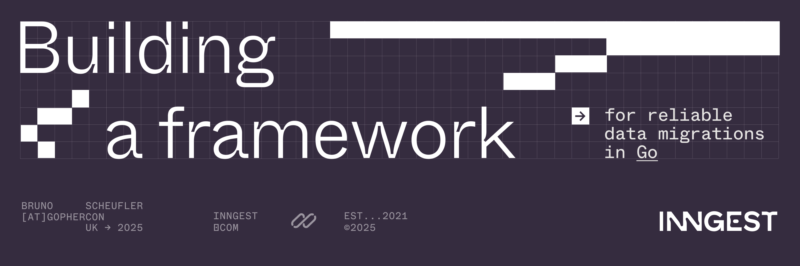
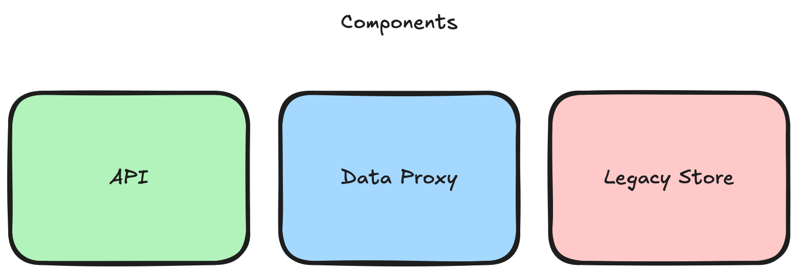
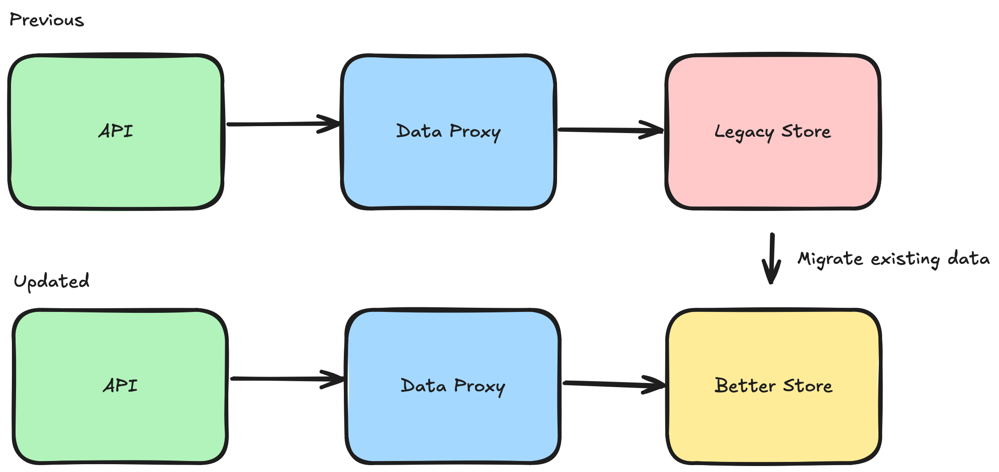
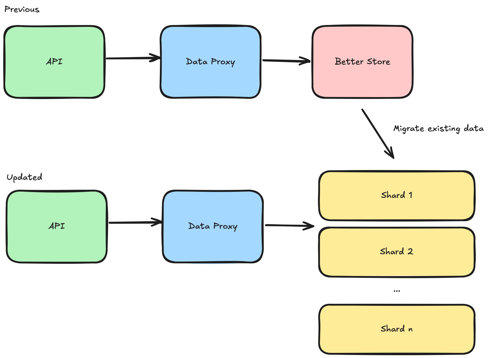

# Building a framework for reliable data migrations in Go

> [!IMPORTANT]  
> Please follow the prerequisites below to set everything up in time for the hands-on exercise at GopherCon UK 2025. This repository is still work in progress, so please check back a couple days before the conference for the final version of the code and slides.

## Prerequisites

> [!NOTE]  
> Most instructions are for macOS and should work on Linux. If you are using Windows, please adapt the commands accordingly or use WSL. Unfortunately, I cannot provide one-on-one support if you are using Windows.

- [ ] [Install Go](https://go.dev/doc/install) v1.24.5 or later
- [ ] Clone this repository

```bash
git clone https://github.com/brunoscheufler/gopherconuk25
```

- [ ] Start the example app

```bash
go run . --cli
```

This should bring up a terminal UI. If it doesn't work, please check every step again and [create an issue](https://github.com/BrunoScheufler/GopherConUK25/issues/new) otherwise.

## Intro

This repository contains the code for _Notely_, an example application we'll use to learn about different migration strategies in Go.

For the purpose of this hands-on exercise, please follow the prerequisites above and start the app in your terminal. Starting the app in CLI mode will display a user interface containing system stats, logs, and migration progress.

### Architecture Overview



The Notely application resembles a classic web application with a REST API and relational database. It uses SQLite for data persistence and includes a telemetry system for monitoring and logging.

Core components include

- **API**: A REST API that allows users to manage their notes ([see routes](./restapi/server.go)).
- **Data Proxy**: A decoupled service mediating data store access. **This is what we are working on today!**
- **Data Store**: A data store implementation. This is [using SQLite](./store/sqlite.go).

### Data format

We will be working with notes. Each note has the following structure:

```go
type Note struct {
 ID        uuid.UUID `json:"id"`
 Creator   uuid.UUID `json:"creator"`
 CreatedAt time.Time `json:"createdAt"`
 UpdatedAt time.Time `json:"updatedAt"`
 Content   string    `json:"content"`
}
```

> [!NOTE]
> As you can see in the struct above, note content is stored in a single field. In a real production application, we might want to break down content even further to avoid migrating excessive amounts of data. For the sake of simplicity, I have omitted this step.

### Running the application with load generation

When started with the `--gen` flag, the application will simulate user activity by generating random notes. You can customize the load generation using the following options:

- `--concurrency <number>`: How many accounts to simulate, defaults to 5.
- `--notes-per-account`: How many notes to manage per account, defaults to 3.
- `--rpm`: How many requests per minute each account should perform, defaults to 60, or one request per second.

As you can see, you can easily adjust the load on the system by simulating more accounts, more notes per account, or increasing the requests per minute performed by each account.

In this simulation, users are very strict: Whenever the APIs return invalid or unexpected note content, this will be visible to you in the UI. This way, "users" act as **consistency checks** for the migration.

### Accessing the API

In case you want to perform manual checks, you can interact with the application using the CLI or a REST client like [Postman](https://www.postman.com/) or [Insomnia](https://insomnia.rest/).

Interesting routes to check include

- `GET /accounts`: List all accounts
- `GET /accounts/{accountID}/notes`: List all notes for a specific account`
- `GET /accounts/{accountID}/notes/{noteID}`: Get a specific note for an account

### Migration completion

While migrations in real-world systems will take hours or days to complete, we can speed this process up. To reduce some complexity, load generation will eventually have invoked updates on all notes. This is a useful property, as it means we can migrate data during the `updateNote()` step.

You do _not_ have to write a one-off migration that moves all leftover data over to the new cluster, as you would in real life. If you wanted to test this, you could manually create some notes and write a migration for those, or tweak the load generation logic to abandon some notes after creation (as real accounts would).

## Hands-on Exercise

### A note on branching

For this exercise, I've prepared multiple branches with varying states of completion. This means you can choose your own adventure based on the time you want to put into this exercise. You can always check out the `hint` branches to unblock yourself or take a look at the full solution on the `complete` branches.

The following branches are available:

- [`exercise1-start`](https://github.com/BrunoScheufler/GopherConUK25/tree/exercise1-start): Start here for exercise 1
- [`exercise1-hint`](https://github.com/BrunoScheufler/GopherConUK25/tree/exercise1-hint): Hints without the solution code
- [`exercise1-complete`](https://github.com/BrunoScheufler/GopherConUK25/tree/exercise1-complete): The full solution
- [`exercise2-start`](https://github.com/BrunoScheufler/GopherConUK25/tree/exercise2-start): Start here for exercise 2
- [`exercise2-hint`](https://github.com/BrunoScheufler/GopherConUK25/tree/exercise2-hint): Hints without the full solution
- [`exercise2-complete`](https://github.com/BrunoScheufler/GopherConUK25/tree/exercise2-complete): The full solution

### Task 1: Migrate data from legacy data store



**Background**: Notely is growing, and we need to migrate away from a legacy data store, to a new, more efficient database. We need to move all existing notes from the legacy data store to the new data store. New notes must be created in the new data store from now on. Users should not notice any difference in the application behavior during the migration process.

**Goal**: Move all notes from the legacy data store to the new data store.

#### Steps

> [!NOTE]
> All changes for this exercise should be made in [`proxy/impl.go`](./proxy/impl.go). You do not need to touch any other files!

- [ ] Update `ListNotes()` to retrieve notes from the new data store in addition to the legacy store, if migrating
- [ ] Update `GetNote()` to retrieve notes from the new data store, if migrating
- [ ] Update `CreateNote()` to store new notes on the new data store, if migrating
- [ ] Migrate existing notes from the legacy data store to the new data store during `Update()`

### Task 2: Implement a sharding strategy for accounts



**Background**: Notely has gone viral and needs to scale horizontally. The current data store will run out of storage in the near future, and we need to implement a sharding strategy to distribute notes across multiple databases. Notes should be stored based on the account shard from now on. Existing accounts must be migrated to the new sharded data store without downtime. Again, users should not notice any difference in the application behavior during the migration process.

**Goal**: Shard notes data by account ID to improve performance and enable horizontal scaling.

#### Steps

- [ ] Assign new accounts to shards based on account ID
- [ ] Create new notes in corresponding shards
- [ ] Migrate existing notes to the expected shards

## Slides

TBA
