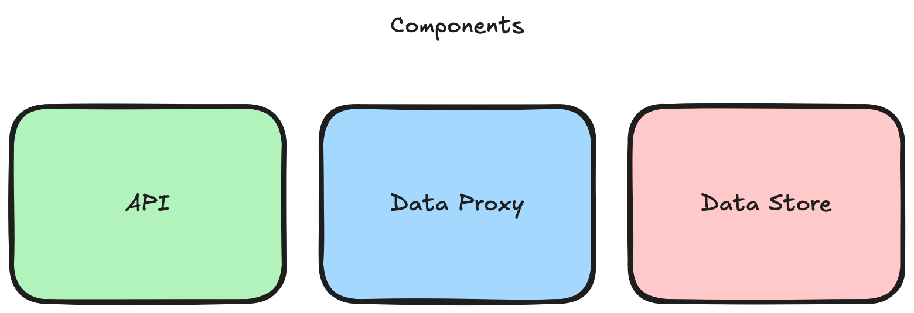

# Building a framework for reliable data migrations in Go

> [!IMPORTANT]  
> Please follow the prerequisites below to set everything up in time for the hands-on exercise at GopherCon UK 2025. This repository is still work in progress, so please check back a couple days before the conference for the final version of the code and slides.

## Prerequisites

> [!NOTE]  
> Most instructions are for macOS and should work on Linux. If you are using Windows, please adapt the commands accordingly or use WSL. Unfortunately, I cannot provide one-on-one support if you are using Windows.

- [ ] [Install Go](https://go.dev/doc/install) v1.24.5 (the latest version)
- [ ] Clone this repository

```bash
git clone https://github.com/brunoscheufler/gopherconuk25
```

- [ ] Start the example app

```bash
go run . --cli
```

This should bring up a terminal UI. If it doesn't work, please check every step again and [create an issue](https://github.com/BrunoScheufler/GopherConUK25/issues/new) otherwise.

## Intro

This repository contains the code for _Notely_, an example application we'll use to learn about different migration strategies in Go.

For the purpose of this hands-on exercise, please follow the prerequisites above and start the app in your terminal. Starting the app in CLI mode will display a user interface containing system stats, logs, and migration progress.

### Architecture Overview



The Notely application resembles a classic web application with a REST API and relational database. It uses SQLite for data persistence and includes a telemetry system for monitoring and logging.

Core components include

- **API**: A REST API that allows users to manage their notes ([see routes](./restapi/server.go)).
- **Data Proxy**: A decoupled service mediating data store access. **This is what we are working on today!**
- **Data Store**: A data store implementation. This is [using SQLite](./store/sqlite.go).

### Data format

We will be working with notes. Each note has the following structure:

```go
type Note struct {
 ID        uuid.UUID `json:"id"`
 Creator   uuid.UUID `json:"creator"`
 CreatedAt time.Time `json:"createdAt"`
 UpdatedAt time.Time `json:"updatedAt"`
 Content   string    `json:"content"`
}
```

### Running the application

When started, the application will simulate user activity by generating random notes. In case you want to perform manual checks, you can interact with the application using the CLI or a REST client like [Postman](https://www.postman.com/) or [Insomnia](https://insomnia.rest/).

Interesting routes to check include

- `GET /accounts`: List all accounts
- `GET /accounts/{accountID}/notes`: List all notes for a specific account`
- `GET /accounts/{accountID}/notes/{noteID}`: Get a specific note for an account

## Hands-on Exercise

### Task 1: Migrate data from legacy data store


**Background**: Notely is growing, and we need to migrate away from a legacy data store, to a new, more efficient database. We need to move all existing notes from the legacy data store to the new data store. New notes must be created in the new data store from now on. Users should not notice any difference in the application behavior during the migration process.

**Goal**: Move all notes from the legacy data store to the new data store.

#### Steps

- [ ] Store new notes on the new data store
- [ ] Migrate existing notes from the legacy data store to the new data store

### Task 2: Implement a sharding strategy for accounts


**Background**: Notely has gone viral and needs to scale horizontally. The current data store will run out of storage in the near future, and we need to implement a sharding strategy to distribute notes across multiple databases. Notes should be stored based on the account shard from now on. Existing accounts must be migrated to the new sharded data store without downtime. Again, users should not notice any difference in the application behavior during the migration process.

**Goal**: Shard notes data by account ID to improve performance and enable horizontal scaling.

#### Steps

- [ ] Assign new accounts to shards based on account ID
- [ ] Create new notes in corresponding shards
- [ ] Migrate existing notes to the expected shards

## Slides

TBA
